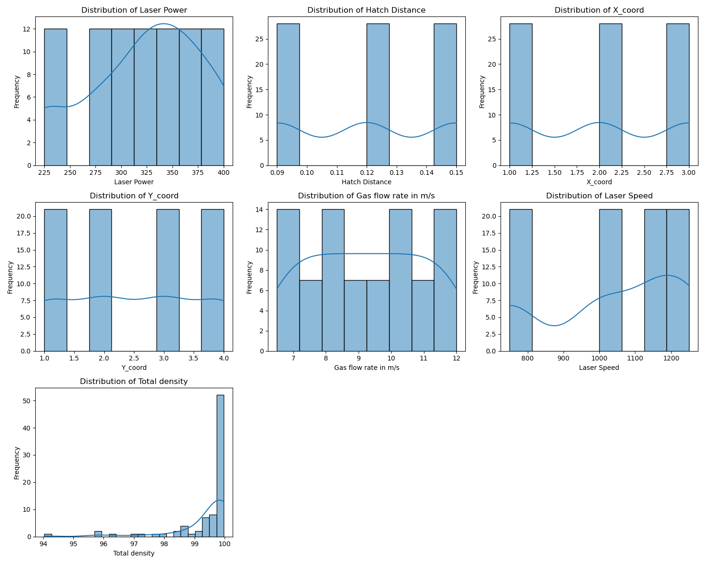

# AM Parts Density Prediction - Data Science Approach

## Overview
I developed a comprehensive machine learning pipeline to predict the density of Additive Manufacturing (AM) parts. This document outlines our data-driven approach, detailing each stage of the pipeline from data preprocessing to model training and evaluation.

## Pipeline Stages

### 1. Data Preprocessing (`data_preprocessor.py`)
   - **Loading Data**: The data is loaded from an `.xlsm` file.
   - **Descriptive Analysis**: We provide a statistical description of the dataset.
   - **Handling Missing Values**: Any missing values in the dataset are filled with the mean value of the respective column.
   - **Normalization**: Specific columns are normalized using Min-Max Scaling to ensure uniformity in data.

### 2. Feature Selection (`feature_selector.py`)
   - **Correlation Heatmap**: Generates a heatmap to visualize the correlation between features, including the target variable.
   - **Feature Importance Analysis**: Utilizes `RandomForestRegressor` to determine the importance of each feature.
   - **Recursive Feature Elimination**: Applies RFE to select the top features that contribute the most to the target variable prediction.

### 3. Model Training and Evaluation (`ml_trainer.py`, `ml_evaluator.py`)
   - **Model Registry**: Registers various models for training.
   - **Model Training**: Trains models like `RandomForestRegressor`, `LinearRegression`, and `Lasso` on the training dataset.
   - **Performance Evaluation**: Evaluates the models using metrics like Mean Squared Error (MSE) and R-squared (R²) on both training and validation datasets.

### 4. Model Prediction (`ml_predictor.py`)
   - **Model Prediction**: Makes predictions on the test dataset.
   - **Performance Evaluation**: Evaluates the final model's performance on the test dataset.
   - **Confidence Interval Calculation**: For RandomForest, calculates confidence intervals for the predictions.

## Experiments

### How will you select the most relevant features? Justify your answer
#### Feature Correlation Heatmap

*Figure 1: Heatmap displaying the correlation between different features used in the model.*

#### Feature Frequency Plot

*Figure 2: Frequency distribution plots for each feature, illustrating the variability within the dataset.*

### Feature Importance Analysis

The following table represents the importance of each feature as determined by the `RandomForestRegressor`. The importance is calculated by how much each feature contributes to the improvement of the model's predictions. The higher the value, the more important the predictor.

| Feature               | Importance |
|-----------------------|------------|
| Laser Power           | 0.454423   |
| Laser Speed           | 0.254031   |
| Hatch Distance        | 0.121952   |
| Gas flow rate in m/s  | 0.103303   |
| Y_coord               | 0.053498   |
| X_coord               | 0.012794   |

These importance scores are computed by fitting a RandomForestRegressor with a specified number of trees (`n_estimators`). Each feature's importance score is the sum of the decrease in error when the feature is used for splitting, averaged over all trees. The values are then normalized to sum to one. This analysis is crucial for understanding which features have the most predictive power for the density of AM parts.

### Feature Selection Justification

Based on the feature importance scores and visual analysis of feature correlations and distributions, the selection criteria include:

- **Statistical Significance**: Preference towards features with higher importance scores as they contribute more to model accuracy.
- **Correlation with Target**: Features directly correlated with 'Total density' are likely to be more predictive.
- **Independent Features**: Avoiding features with high inter-feature correlation to reduce multicollinearity.

#### Selected Features

- `Laser Power` (Importance: 0.454423) and `Laser Speed` (Importance: 0.254031) are the most predictive features with sufficient variability and impact on the target variable.
- `Hatch Distance` (Importance: 0.121952) and `Gas flow rate in m/s` (Importance: 0.103303) show potential predictive power and are less correlated with other features.
- `Y_coord` (Importance: 0.053498) is considered for its moderate importance despite low variability.
- `X_coord` (Importance: 0.012794) is the least important and may be excluded if model simplicity is prioritized.

The above features are selected to optimize the model's performance while maintaining simplicity and interpretability.

