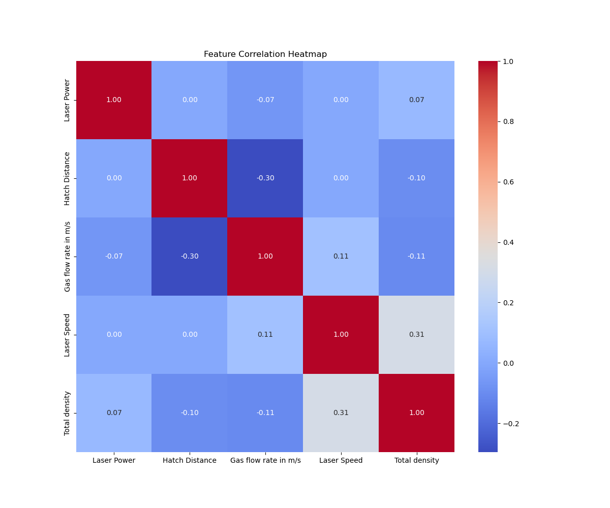

# AM Parts Density Prediction - Data Science Approach

## Overview
I developed a comprehensive machine learning pipeline to predict the density of Additive Manufacturing (AM) parts. This document outlines our data-driven approach, detailing each stage of the pipeline from data preprocessing to model training and evaluation.

## Pipeline Stages

### 1. Data Preprocessing (`data_preprocessor.py`)
   - **Loading Data**: The data is loaded from an `.xlsm` file.
   - **Descriptive Analysis**: We provide a statistical description of the dataset.
   - **Handling Missing Values**: Any missing values in the dataset are filled with the mean value of the respective column.
   - **Normalization**: Specific columns are normalized using Min-Max Scaling to ensure uniformity in data.

### 2. Feature Selection (`feature_selector.py`)
   - **Correlation Heatmap**: Generates a heatmap to visualize the correlation between features, including the target variable.
   - **Feature Importance Analysis**: Utilizes `RandomForestRegressor` to determine the importance of each feature.
   - **Recursive Feature Elimination**: Applies RFE to select the top features that contribute the most to the target variable prediction.

### 3. Model Training and Evaluation (`ml_trainer.py`, `ml_evaluator.py`)
   - **Model Registry**: Registers various models for training.
   - **Model Training**: Trains models like `RandomForestRegressor`, `LinearRegression`, and `Lasso` on the training dataset.
   - **Performance Evaluation**: Evaluates the models using metrics like Mean Squared Error (MSE) and R-squared (R²) on both training and validation datasets.

### 4. Model Prediction (`ml_predictor.py`)
   - **Model Prediction**: Makes predictions on the test dataset.
   - **Performance Evaluation**: Evaluates the final model's performance on the test dataset.
   - **Confidence Interval Calculation**: For RandomForest, calculates confidence intervals for the predictions.

## Experiments

### How will you select the most relevant features? Justify your answer
#### Feature Correlation Heatmap

*Figure 1: Heatmap displaying the correlation between different features used in the model.*

#### Feature Frequency Plot

*Figure 2: Frequency distribution plots for each feature, illustrating the variability within the dataset.*

### Feature Importance Analysis

The following table represents the importance of each feature as determined by the `RandomForestRegressor`. The importance is calculated by how much each feature contributes to the improvement of the model's predictions. The higher the value, the more important the predictor.

| Feature               | Importance |
|-----------------------|------------|
| Laser Power           | 0.454423   |
| Laser Speed           | 0.254031   |
| Hatch Distance        | 0.121952   |
| Gas flow rate in m/s  | 0.103303   |
| Y_coord               | 0.053498   |
| X_coord               | 0.012794   |

*Table 1: Feature Importance Scores from RandomForestRegressor*

These importance scores are computed by fitting a RandomForestRegressor with a specified number of trees (`n_estimators`). Each feature's importance score is the sum of the decrease in error when the feature is used for splitting, averaged over all trees. The values are then normalized to sum to one. This analysis is crucial for understanding which features have the most predictive power for the density of AM parts.

### Feature Selection Justification

The selection of features is a crucial step that affects the performance of the predictive model. The decisions are made by analyzing the importance scores, the correlation of features with the target variable 'Total density', and the independence between features to mitigate multicollinearity.

#### Criteria for Selection:

- **Statistical Significance**: Features with higher importance scores are indicative of a greater impact on model accuracy and are therefore emphasized.
- **Correlation with Target**: Features that show a significant correlation with 'Total density' are likely to have better predictive power.
- **Independent Features**: It is crucial to select features that exhibit low inter-feature correlation to prevent multicollinearity, which can affect model stability and interpretability.

#### Detailed Performance Analysis of Selected Features:

- `Laser Power` (Importance: 0.454423) stands out as the most significant predictor. The distribution plot shows a wide spread, indicating diverse data points that the model can learn from. The correlation heatmap suggests that this feature is not highly correlated with others, underlining its unique contribution to the model.

- `Laser Speed` (Importance: 0.254031) is also highly regarded due to its substantial variability observed in the distribution plot, which is a desirable attribute for a predictive feature. The correlation heatmap reveals that it has a moderate positive relationship with the target variable, reinforcing its selection.

- `Hatch Distance` (Importance: 0.121952) is included based on its moderate importance score and its distribution which, although less varied than 'Laser Power' and 'Laser Speed', still provides a decent amount of information. The heatmap indicates a negative correlation with 'Gas flow rate in m/s', suggesting that it captures different aspects of the data.

- `Gas flow rate in m/s` (Importance: 0.103303) is chosen due to its notable contribution to model predictions and its distinctive distribution, as seen in the histograms. Despite some level of correlation with 'Hatch Distance', its unique variance justifies its inclusion.

The selection of these features is expected to yield a model that accurately predicts 'Total density' while maintaining a balance between complexity and interpretability.

## Model Performance Comparison

The table below presents a comparison of the RandomForest, LinearRegression, and Lasso models based on Mean Squared Error (MSE) and R-squared (R²).

| Model             | Training MSE          | Training R²          | Validation MSE       | Validation R²        |
|-------------------|-----------------------|----------------------|----------------------|----------------------|
| RandomForest      | 0.1092448306896582    | 0.9127221214412975   | 0.04174671333333727  | 0.8758478011205404   |
| LinearRegression  | 1.0956012821135823    | 0.1247022394980919   | 0.3671354552990021   | -0.09183862446923996 |
| Lasso             | 1.2126750879999653    | 0.031169636188156602 | 0.3267284658391647   | 0.028329316692535023 |

*Table 2: Training and Validation Performance Metrics for Predictive Models with selected features*

These metrics indicate the RandomForest model's superior performance in terms of both MSE and R², suggesting it is more accurate and a better fit for the data. LinearRegression and Lasso, while valuable for comparative analysis, show less favorable results, particularly in their lower R² values.

### Understanding MSE and R²:

- **Mean Squared Error (MSE)**: This metric measures the average squared difference between the observed actual and predicted values. A lower MSE indicates a more accurate model.

- **R-squared (R²)**: This is the proportion of variance in the dependent variable that can be explained by the independent variables. R² closer to 1 indicates a stronger correlation between the observed and predicted values.

### Model Selection Justification:

- **RandomForest Regression** was selected as the primary model due to its superior performance in both MSE and R². This model's non-parametric nature allows it to effectively handle the right-skewed distribution of the target variable and capture complex relationships within a small dataset (84 data points).

- **Linear Regression and Lasso** were utilized for comparative testing. Although they provided valuable insights, their performance metrics were notably inferior to the RandomForest model. Linear Regression, with a negative R² value on validation, indicated a poor fit for the data, while Lasso showed only marginal improvement.

The RandomForest model's robustness to the distributional characteristics of the data and its ability to handle non-linear relationships makes it the most suitable choice for accurately predicting 'Total density' in AM parts.

### Understanding RandomForest Regression

Imagine RandomForest Regression as a team of experts where each expert (a "tree") specializes in different aspects of the problem. Here's a simple breakdown of how it works:

#### Concept:
- Think of RandomForest as a team decision rather than a decision made by one person. It combines the knowledge of multiple experts to make a better prediction.

#### Process:
1. **Creating Experts (Trees)**: The algorithm creates several experts. Each expert looks at the problem (the data) in its own unique way. This is like creating a diverse team where each member brings different insights.

2. **Each Expert Learns Differently**: Instead of each expert looking at the whole picture, they focus on specific parts. This way, they become specialized in understanding different areas of the data.

3. **Making a Group Decision**: When it's time to make a prediction, each expert gives their opinion. The RandomForest model then averages these opinions to come up with a final decision. It's like pooling together different expert opinions to get a more balanced and accurate answer.

4. **Avoiding Bias**: One great thing about RandomForest is that it avoids getting too fixated on specific patterns in the data (which might be misleading). This is like ensuring the team doesn't rely too much on one expert's opinion, thus avoiding bias.

### Overfitting and Generalisability in RandomForest Models

#### Addressing Overfitting in RandomForest
Overfitting occurs when a machine learning model captures noise or random fluctuations in the training data rather than the underlying pattern, leading to poor performance on unseen data. RandomForest, an ensemble learning technique, is generally robust against overfitting due to its nature of aggregating results from multiple decision trees. However, it's still crucial to implement strategies to ensure the model is not overly complex and is generalizable.

##### Techniques Used:
1. **Hyperparameter Tuning**: Adjusting parameters such as the number of trees (`n_estimators`), maximum depth of trees (`max_depth`), and the minimum number of samples required to split a node (`min_samples_split`). These parameters help control the complexity of the model.
2. **Bootstrapping and Aggregation**: RandomForest uses bootstrapping (sampling with replacement) for tree construction and aggregates their predictions. This method naturally guards against overfitting.

#### Ensuring Generalisability with Cross-Validation
To ensure the model's generalizability and robustness:

##### K-Fold Cross-Validation:
- **Method**: The dataset is divided into 'k' subsets. The model is trained on 'k-1' subsets and validated on the remaining subset. This process is repeated 'k' times, with each subset used exactly once as the validation data.
- **Advantage**: It provides a thorough assessment over different subsets, giving a more holistic view of the model's performance.
- **Application**: This method was applied to the RandomForest model to evaluate its performance across various splits of the dataset, ensuring that the model's accuracy is consistent and not just tailored to a specific subset of data.

##### Leave-One-Out Cross-Validation (LOOCV):
- **Method**: A special case of k-fold cross-validation where 'k' is equal to the number of data points. Each time, the model is trained on all data points except one and validated on the left-out data point.
- **Advantage**: It uses almost all data for training, making it a good choice for small datasets. It also reduces bias in model assessment.
- **Application**: LOOCV was also used for the RandomForest model, particularly beneficial for fine-grained assessment when the dataset size is limited.

#### Conclusion
In conclusion, by carefully tuning hyperparameters, and employing rigorous cross-validation techniques like k-fold and LOOCV, the RandomForest model's tendency to overfit is significantly mitigated. These steps ensure that the model not only performs well on the training data but also generalizes effectively to new, unseen data. This balanced approach makes RandomForest a reliable and robust choice for predictive modeling tasks.

## Best Hyperparameters for RandomForest

| Parameter         | Value |
|-------------------|-------|
| `max_depth`       | 10    |
| `max_features`    | sqrt  |
| `min_samples_split` | 2   |
| `n_estimators`    | 100   |

## TunedRandomForest Cross-Validation Performance

| Fold  | MSE Score    | R² Score     |
|-------|--------------|--------------|
| 1     | 2.10034339   | 0.05110565   |
| 2     | 2.74699014   | 0.07753773   |
| 3     | 0.08985296   | 0.52991261   |
| 4     | 0.13875415   | -1.16926619  |
| 5     | 0.18696119   | -0.34926427  |
| **Average** | **1.0525803667612172** | **-0.17199489302890097** |

## TunedRandomForest LOOCV MSE Scores

| Folds   | MSE Scores                                    |
|---------|-----------------------------------------------|
| 1-5     | 7.83, 5.13, 0.03, 0.12, 0.21                 |
| 6-10    | 0.08, 1.73, 0.85, 0.09, 0.37                 |
| 11-15   | 0.01, 0.22, 1.46, 0.04, 0.29                 |
| 16-20   | 1.59, 28.17, 0.04, 0.02, 0.03                |
| 21-25   | 0.22, 0.29, 0.16, 0.54, 0.24                 |
| 26-30   | 0.01, 0.003, 0.002, 0.01, <0.00001           |
| 31-35   | 0.02, 0.48, 0.20, 0.0008, 0.33               |
| 36-40   | 0.01, 0.76, 0.004, 0.02, 0.36                |
| 41-45   | 1.28, 0.11, 0.001, 0.05, 0.07                |
| 46-50   | 0.02, 0.01, 0.02, 0.29, <0.0001              |
| 51-55   | 0.26, 0.06, 0.55, 0.02, 0.03                 |
| 56-58   | 0.09, 0.63, 0.006                            |

**Average MSE Score**: 0.956771652622797

